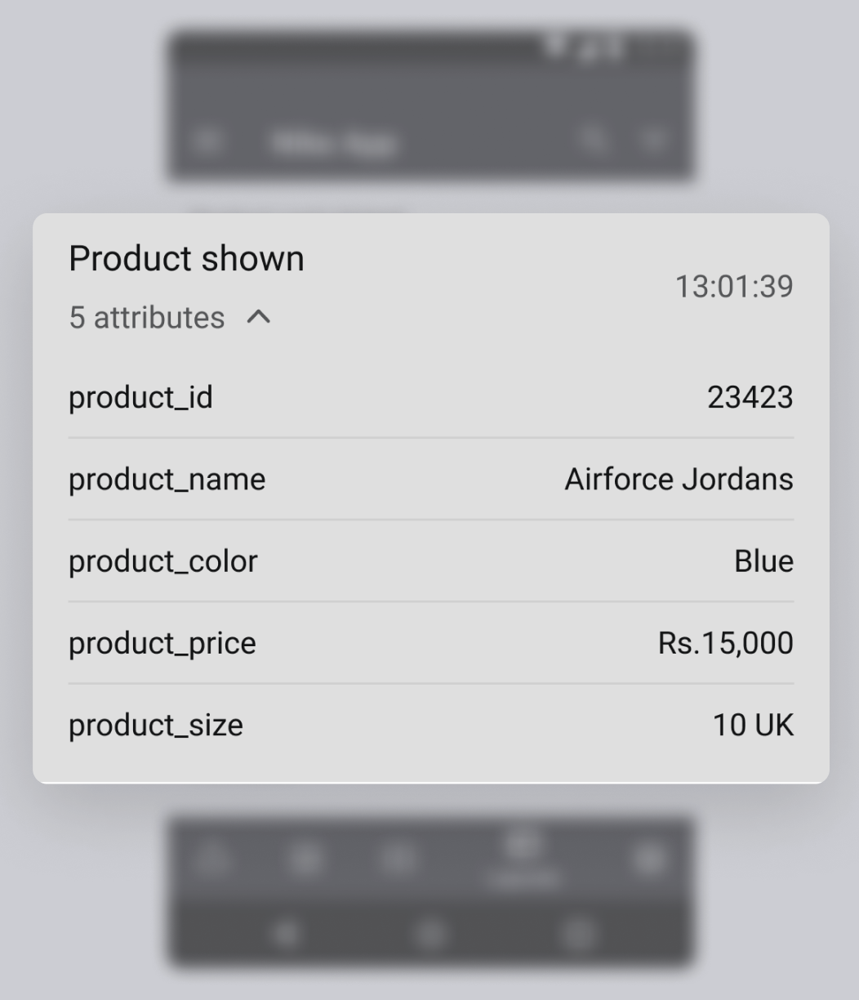

<p align="center"></p>

<h2 align="center">Chrome like developer tool for Android debug builds</h2>

<p align="center">
    <a href="https://github.com/requestly/requestly-android-sdk/releases"></a>
    <a href="https://search.maven.org/search?q=io.requestly%20-library"></a>
</p>

<p align="center">
    
</p>

Requestly Android SDK lets you debug your android apps without needing you to setup any proxies or install any certificates everytime. It makes easy to identify & debug your Android Apps faster and save your time.

- [Installation](#installation)
- [SDK Initialization](#sdk-initialization)
- [API Debugger Initialization](#api-debugger-initialization)
  - [okHttp](#okhttp)
  - [Retrofit](#retrofit)
- [Features](#features)
  - [API Debugger](#api-debugger)
  - [Analytics Event Debugger](#analytics-event-debugger)
  - [Logs Debugger](#logs-debugger)
  - [Host Switcher](#host-switcher)
- [Try Now](#try-now)
- [Acknowledgments](#acknowledgments)
  
## Installation
The best way to install the Requestly Android SDK is with a build system like Gradle. This ensures you can easily upgrade to the latest versions.

RQInterceptor is distributed through [Maven Central](https://search.maven.org/search?q=io.requestly%20-library). To use it you need to add the following Gradle dependency to your build.gradle file of you android app module (NOT the root file)

```
dependencies {
    debugImplementation "io.requestly:requestly-android:2.4.3"
    releaseImplementation "io.requestly:requestly-android-noop:2.4.3"
    debugImplementation "io.requestly:requestly-android-okhttp:2.4.3"
    releaseImplementation "io.requestly:requestly-android-okhttp-noop:2.4.3"
}
```

## SDK Initialization
Initialize the Requestly SDK in your Application class onCreate method.

```
class App : Application(){
    override fun onCreate() {
        super.onCreate()
        
        // Initialize Requestly SDK like this
        Requestly.Builder(this, [optional "<your-sdk-key>"])
            .build()
    }
}
```
> `sdk-key` is optional. You can use local devtool features without sdk-key. <br/>
To get the sdk key, you need to create an app. Follow the steps [here](https://docs.requestly.io/android/tutorial/create-app) to create an app.

## API Debugger Initialization
To configure the Interceptor, you need to initialize the RQCollector and then add rqInterceptor as the last interceptor to your okHttpClient

### okHttp
```
val collector = RQCollector(context=appContext)

val rqInterceptor = RQInterceptor.Builder(appContext)
    .collector(collector)
    .build()
    
val client = OkHttpClient.Builder()
    .addInterceptor(rqInterceptor)
    .build()
```

### Retrofit
```
Retrofit.Builder()
    .baseUrl(APIUtils.API_BASE_URI)
    .client(okHttpClient) // okHttpClient with RQInterceptor
    .build();
```

## Features

### API Debugger
Lets you view and modify HTTP traffic. It comes with these capabilities to:
- **InApp Inspector** : Directly view your HTTP request from your phone.
- **Modify API**: Modify Response, Redirect Request, Delay Request and many more.


### Analytics Event Debugger
Debug & Validate your Analytics Events directly from your App. The SDK provides a simple API to send your events.

```kotlin
RequestlyEvent.send(<eventName: String>, <eventData:Map<String, Any>>)
```



### Logs Debugger
Debug your Logs directly from your App. No need to connect your device to your computer to know what's happening inside your app.


### Host Switcher
Switch between production and staging APIs easily in your Android debug builds. Eg. api.requestly.io → staging.requestly.io


## Try Now

<a href="https://appetize.io/embed/ctumozxsaz6cj4wox36vjc7jwy?device=pixel6pro&osVersion=12.0&scale=75&deviceColor=black"></a>

## Acknowledgments
Special Thanks to chuckerteam for maintaining such an awesome project because of which rq-interceptor was possible
https://github.com/chuckerteam/chucker
